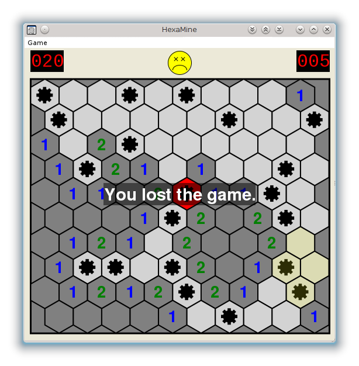

HexaMine
========

Minesweeper clone with hexagonal fields, written in C#.
Features a manually coded WinForms interface, runs on Linux (mono) and Windows (.NET).
Should run on OS X. However, this is untested.

This was mainly created as a small project because I was bored.

This has no explicit license, as long as you do not sell my code, I am totally fine.
Have fun!